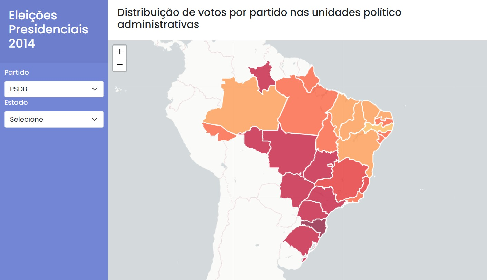
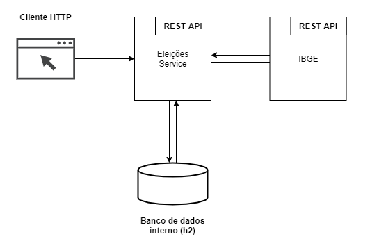

# Case Eleições Presidenciais de 2014

### Introdução

Este projeto está divido em um módulo front-end e um módulo back-end.

### Arquitetura da aplicação

### Requisitos

- Back-end
  - Java 1.8
  - Spring boot 2.4.5
  - Spring boot JPA
  - Lombok
  - Json-simple 1.1.1
  - Maven
  - Banco de dados H2

* Front-end
  * HTML
  * CSS
  * Jquery
  * Bootstrap
  * Leaflet

### Executar a aplicação

Para executar a aplicação deve-se ter o Java versão 1.8 e o Maven configurados.

1. Clonar o repositório da aplicação e acessar a pasta /eleicoes-backend/.

2. Para gerar o arquivo .jar executar o comando abaixo:

   `mvn clean install`

   **O arquivo eleicoes-0.0.1-SNAPSHOT.jar será gerado na pasta /eleicoes-backend/target/.

3. Copiar o arquivo do banco de dados (/eleicoes-backend/eleicoes.mv.db) para o diretório /eleicoes-backend/target/.

4. Executar o comando abaixo para iniciar a aplicação back-end:

   `java -jar eleicoes-0.0.1-SNAPSHOT.jar` 

5. Abrir o arquivo /eleicoes-frontend/index.html

### Executar aplicação através do Docker

1. Criar o contêiner:

   `docker build -t eleicoes:v0.0.1 .`

2. Executar o contêiner:

   `docker run -p 8080:8080 eleicoes:v0.0.1`

### Próximos passos

- Implementar os testes;
- Documentar a API utilizando a biblioteca Swagger.
